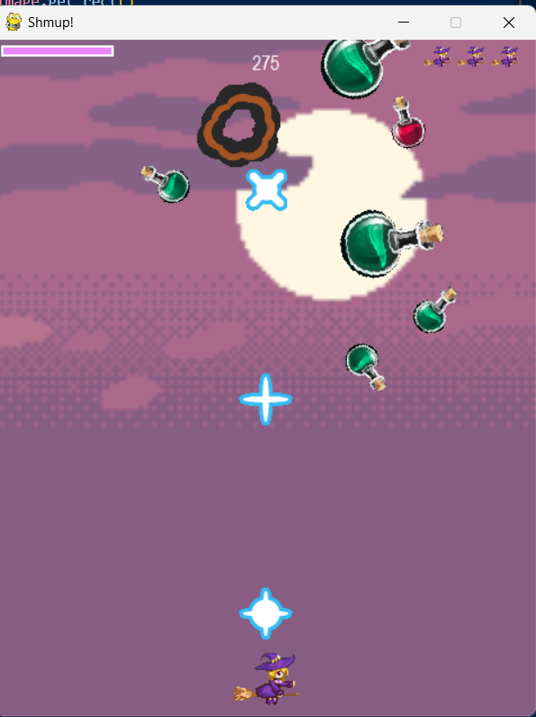

MAS2011-shmup
=============
### Play Space Shooter👾

* Playing Video
  
  <https://youtu.be/9ylLP8C-6PA>

* How To Play❓

    When you start the program, you will be the witch, and obstacle(potion) rotate. If push *space bar*, you can shoot bullet. If push the *left, right key*, you can avoid the obstacle. On the upper left screen, there is an HP bar that shrinks when it crushes a obstacle. When you crush with meteor and die, don't worry. You have *3 chance* additionally. 

    Good Luck!🌟

* Playing image
  
  </img>

* plyer, bullet, obstacle

    </img>
    </img>
    </img>
* code 
    ```python
        bullet_img = []
        bullet_list = ["laserBlue09.png", "laserBlue10.png", "laserBlue08.png"]
        for bimg in bullet_list:
            bullet_img.append(pygame.image.load(path.join(img_dir, bimg)).convert())
    ```
    ```python
        class Bullet(pygame.sprite.Sprite):
        def __init__(self, x, y):
            pygame.sprite.Sprite.__init__(self)
            self.image_orig = random.choice(bullet_img)
            self.image_orig.set_colorkey(BLACK)
            self.image = self.image_orig.copy()
            self.rect = self.image.get_rect()
            self.rect.bottom = y
            self.rect.centerx = x
            self.speedy = -10
    ```

    define 3 bullet images, and randomly appear.

* Preparation for writing code🫠
  
  Look around '*www.opengameart.org*', and pick great image and bgm. Make effect sound with Bfxr. When make obstacle image and background image, I used photo editor to adjust image's size. I needed to careful to define image and sound file.
